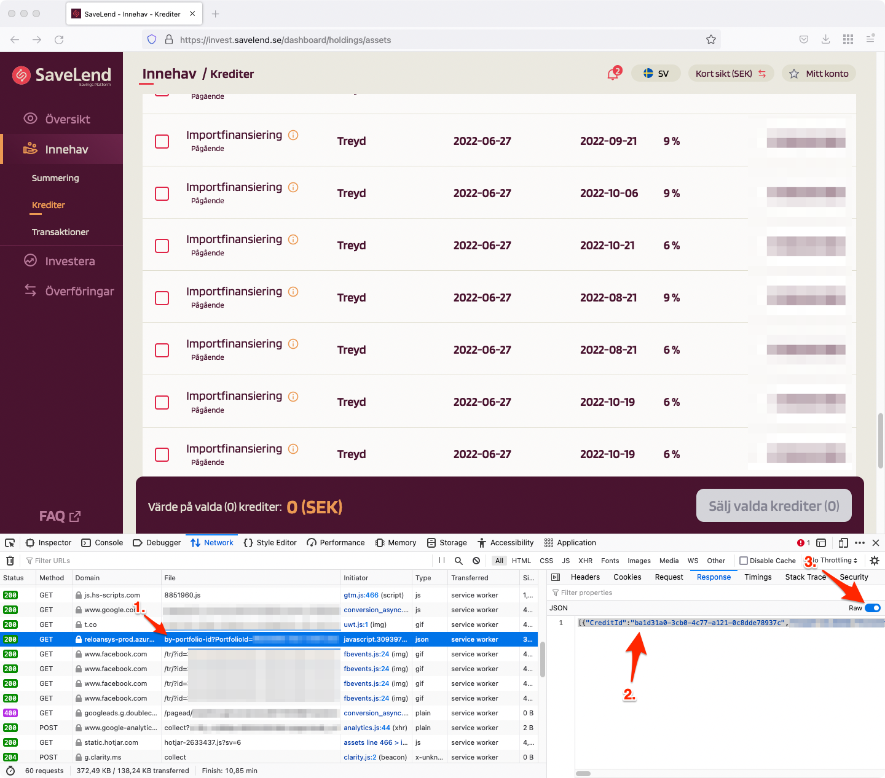

Savelend tools
==============
[Savelend][savelend] is a Swedish peer-to-peer lending site similar to
[LendingClub][lendingclub]. Unfortunately Savelend doesn't expose (IMO) enough
data about my portfolio so this repository contains utility tools to analyse
your portfolio more in-depth.

[savelend]: https://savelend.se/
[lendingclub]: https://www.lendingclub.com/

How to get your data out of SaveLend?
-------------------------------------
Unfortunately Savelend doesn't make it easy to extract a list of your credits.
However, they do have a REST API that allows you to extract it[^1] using
some basic reverse engineering[^2].

[^1]: I have reached out to Savelend and made a feature request to be able to download this as a CSV file or something. Feel free to send an e-mail to support@savelend.se if you would like this, too!
[^2]: I have checked with Savelend's support if they were fine with me publishing these scripts and reverse engineering their API. They were fine as long as scripts aren't impacting their availability/load in any way.



To download your credits as JSON, do this:

 1. Log in to Savelend.
 2. Open up your "Web Developer Tools" and click the "Network" tab.
 3. In the left-hand menu, open up the Savelend page that contains the list of
    credits. See screenshot.
 4. In your Network calls, find the REST API call that starts with
    `by-portfolio-id`. Click it. See screenshot.
 5. Open up the response and enable "Raw". See screenshot.
 6. Copy the JSON response and store it in a file locally on your computer.

Tools
-----
All tools are written in Python and use [`pipenv`][pipenv] for third party
dependencies. To use any of the tools, first `cd` into the checked out
repository and execute `pipenv shell`.

[pipenv]: https://pipenv.pypa.io

### `stats.py`

This script extracts a bunch of insights from your credits. Here is an example
output with some fake data:
```sh
$ ./stats.py by_portfolio_api_KORT_2022-08-03.json
Statuses
--------
          Performing: 71.59% (63)
              Repaid: 23.86% (21)
                Late: 4.55% (4)

Asset classes
-------------
           Factoring: 76.14% (67)

Originators
-----------
                         Treyd: 63.64% (56)
       Billecta FI - Factoring: 12.50% (11)

Order depth (cumulative, interest included)
-------------------------------------------
       5.0%           -1 day, 0:00:00    3641.64 SEK
      10.0%           8 days, 0:00:00    5524.07 SEK
      25.0%          27 days, 0:00:00    6975.13 SEK
      50.0%          64 days, 0:00:00    9073.13 SEK
      75.0%          85 days, 0:00:00   44789.21 SEK
      90.0%          94 days, 0:00:00   53981.81 SEK
      99.0%         100 days, 0:00:00   70416.13 SEK
```

### `simulation.py`

This is a script that, based on past credits, executes a Monte Carlo simulation
to estimate how your portfolio will behave in the future. The script uses the
excellent [SimPy][simpy] for simulation.

NOTE! Your past credit history can generally *NOT* project your future history!

[simpy]: https://simpy.readthedocs.io

Sample execution:
```sh
./simulation.py by_portfolio_api.json
Initial amount:        10000.00 SEK
Number of simulations: 10

Summary of marginal gains (positive is profit, negative is loss):
             Average: 6.48% (10647.99 SEK)
     0th percentile:: 6.28% (10628.33 SEK)
     1th percentile:: 6.30% (10629.61 SEK)
     5th percentile:: 6.35% (10634.69 SEK)
    10th percentile:: 6.41% (10641.05 SEK)
    25th percentile:: 6.44% (10643.80 SEK)
    50th percentile:: 6.49% (10649.49 SEK)
    75th percentile:: 6.54% (10653.58 SEK)
    90th percentile:: 6.58% (10657.61 SEK)
    95th percentile:: 6.58% (10657.79 SEK)
    99th percentile:: 6.58% (10657.94 SEK)
   100th percentile:: 6.58% (10657.97 SEK)

(all percentages are yearly, before taxes and before service fee)
```

Before running the simulation, make sure to review your max Savelend credit ratios [here][ratios]!

[ratios]: https://github.com/JensRantil/savelend-tools/blob/1bc0532ad6b4157e42ebccc9e5f130a2cada2c6c/simulation.py#L95-L120
